# lla-editor

> 本项目使用 Slate 作为基础。旨在打造 React 友好的富文本编辑器。

项目使用 mono repo 架构,使用`@lla-core`作为核心，使用插件架构，方便使用过程中的按需引入。

本项目目前实现了一些较为基础的富文本块。示例如下：

## 提示框

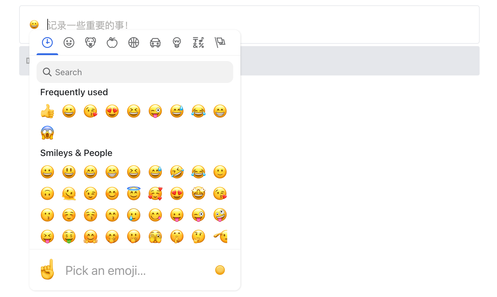

## 代码块

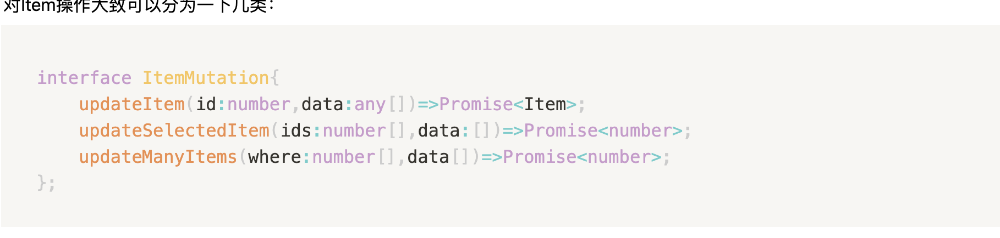

## Heading

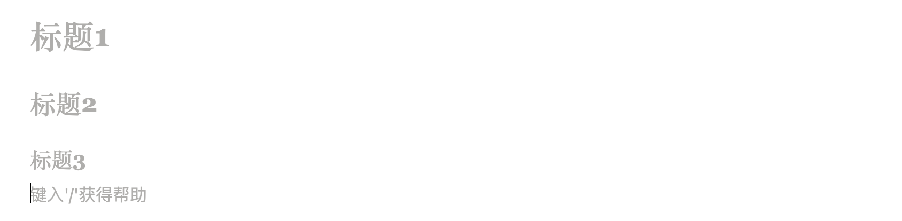

## 图片

## Link

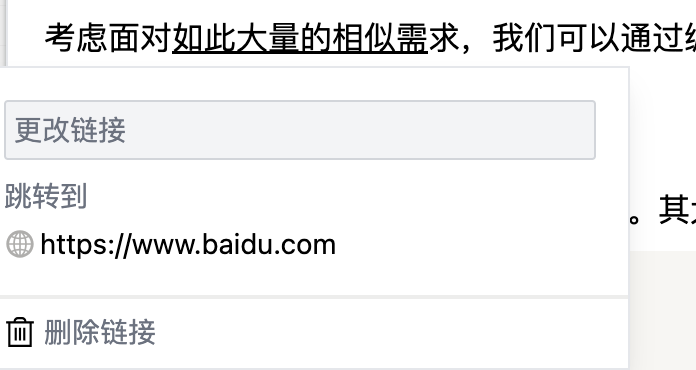

## 嵌套列表

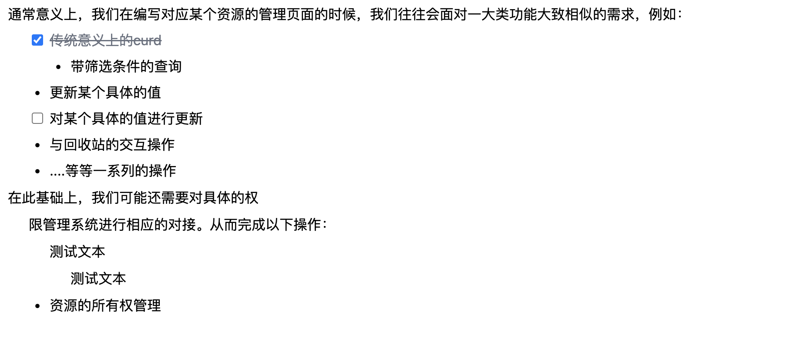

## 视频

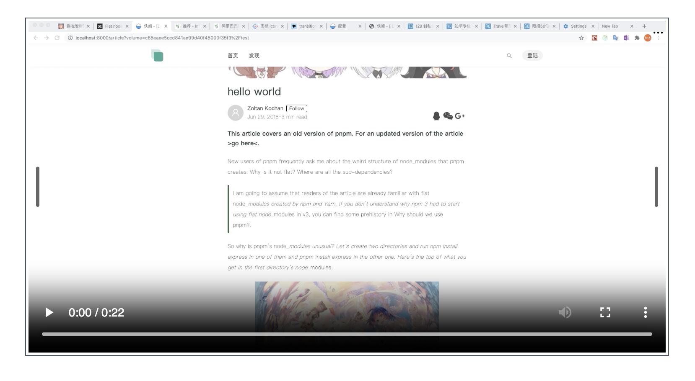

## 引言

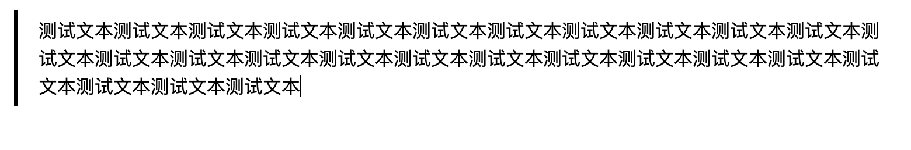

## 块间样式

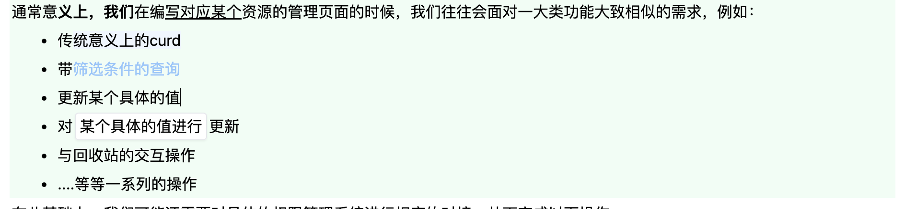

为了编辑方便，同时提供了快捷插入和样式工具栏。
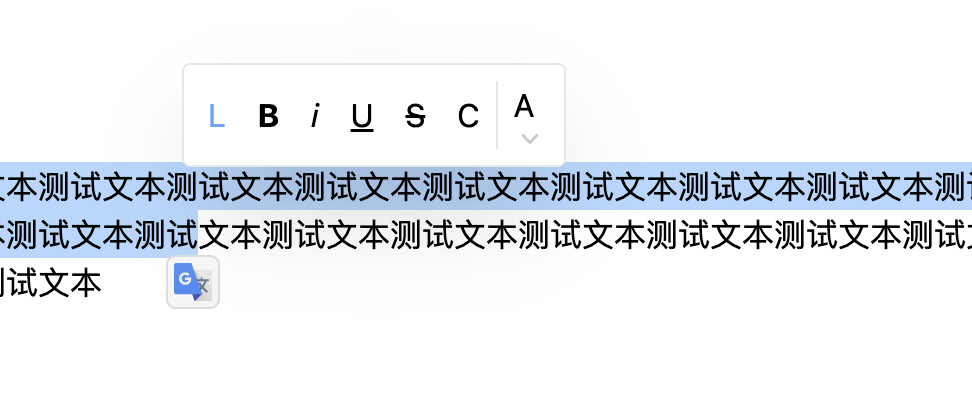
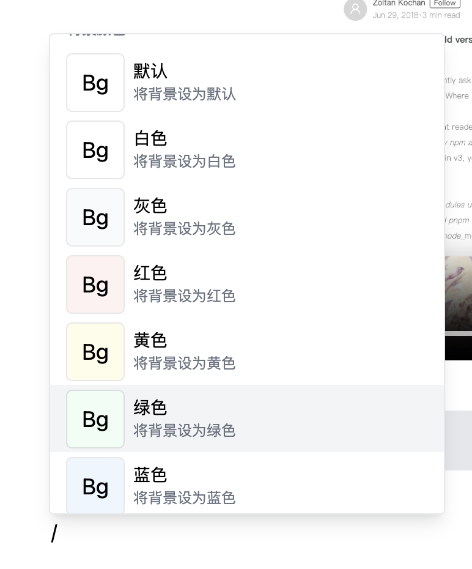
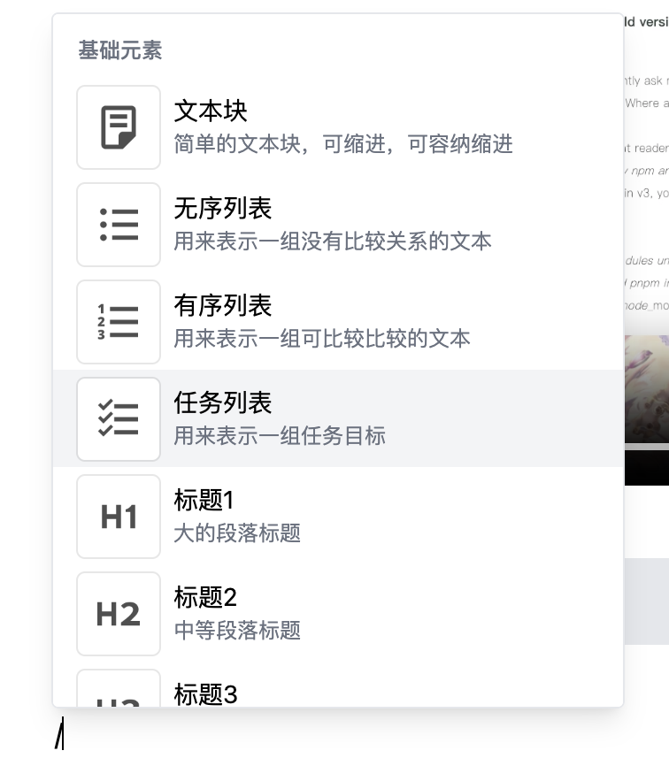
